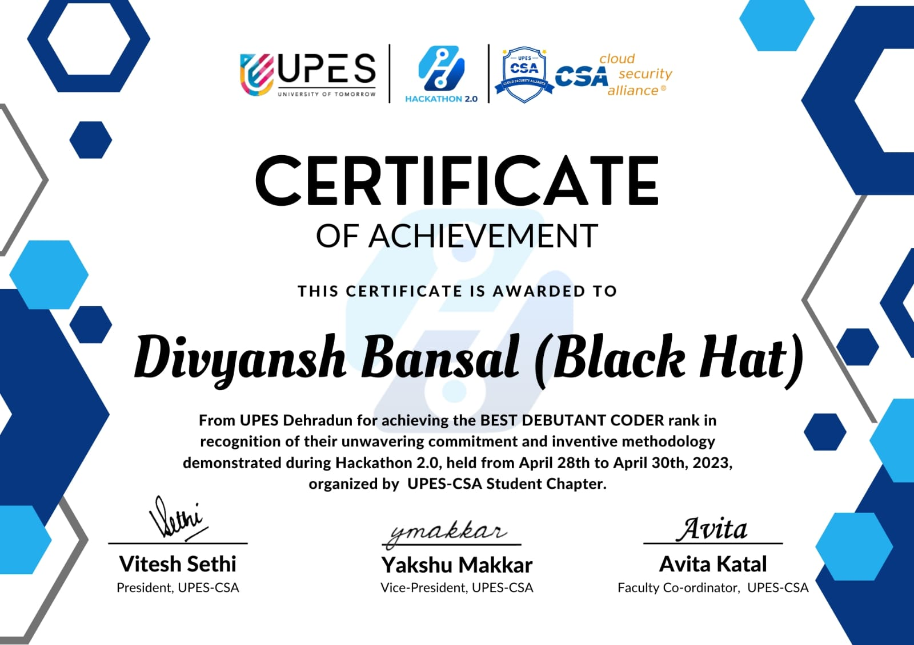

# 🛡️Safer-Route-Navigation(SheSafe)

SheSafe is a full-stack application that helps users evaluate safer routes by analyzing crime data along selected paths. The platform calculates a **crime quotient** using dummy JSON data (in this prototype) and provides safer navigation insights.

---

## 🚀 Features

* Interactive **React frontend** with a live map.
* **Express.js backend** serving crime data.
* Crime Quotient calculation using latitude & longitude.
* Modular React components for easy extension.
* Simple JSON-based data integration.

---

## 🛠️ Project Structure

```
SheSafe/
├─ client/                # React app (frontend)
│  ├─ public/             # static assets + index.html
│  ├─ src/                # components + pages
│  └─ package.json        # frontend dependencies
│
└─ server/                # Express API backend
   ├─ data/crimeData.json # dummy dataset
   ├─ server.js           # backend server
   └─ package.json        # backend dependencies
```

---

## ⚙️ Setup Instructions

### 1️⃣ Clone the repository

```bash
git clone https://github.com/YOUR_GITHUB_USERNAME/SheSafe.git
cd SheSafe
```

### 2️⃣ Setup environment variables

Create a `.env.local` file inside `client/` and paste:

```env
REACT_APP_GOOGLE_MAPS_API_KEY=YOUR_GOOGLE_MAPS_API_KEY
REACT_APP_SERVER_URL=http://localhost:5000
```

### 3️⃣ Install dependencies

Frontend:

```bash
cd client
npm install
```

Backend:

```bash
cd ../server
npm install
```

### 4️⃣ Run the app

Start backend:

```bash
cd server
npm start
```

Start frontend:

```bash
cd ../client
npm start
```

The app will be running at **[http://localhost:3000](http://localhost:3000)** 🎉

Scroll down to see the map and input your start and end locations to get safer route suggestions!


---

## 📊 Crime Quotient

* The backend reads from `crimeData.json`.
* Each route segment is assigned a **crime quotient**.
* Safer routes are suggested visually on the map.

---

## 🏆 Achievement

We presented **SheSafe** as part of a hackathon project — and **we won!** 🎉

To use an image hosted in this repo, add your image file inside `client/public/assets/` (e.g., `win.png`) and then reference it like this:

```markdown

```

✅ This way the image is always available as long as it exists in the repo.
